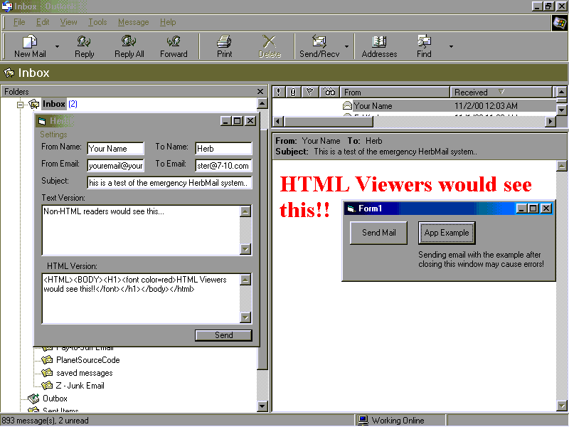

<div align="center">

## Text & HTML Version Email Sending, based on Contest Winner\.\. WinSock/SMTP


</div>

### Description

NOTE TO VB5 USERS: Replace is used and would need <br>

to be translated using Replace 'Replacements' <br>

here at PSC...<p>

This code is based on code by: Brian Anderson, <br>

Planet Source Code Winner for Simple Mail <br>

Testing Program <br>

<a href="http://www.planet-source-code.com/xq/ASP/txtCodeId.841/lngWId.1/qx/vb/scripts/ShowCode.htm">http://www.planet-source-code.com/xq/ASP/txtCodeId.841/lngWId.1/qx/vb/scripts/ShowCode.htm</a><br>

<br>

That said, I have improved on that framework by <br>

adding OPTIONAL Multipart/Alternative sending <br>

capability. Simple Class File enables event-<br>

driven status monitoring and can handle sending <br>

multiple emails simultaneously.. (Suggested <br>

limit 5 since it is not multi-threaded!)<br><br>

Code is commented to try to explain as much as <br>

possible, and comments/questions will be <br>

answered<br><br>

This code was a potential candidate for a <br>

product that sends email to over 1 Million <br>

people on a list, but adequate speeds could not<br>

be reached. Highest clocked speed with a local <br>

(intranet) SMTP server was over 9000/hour, <br>

including going through a SQL table and sending <br>

to unique emails (SQL parts removed)<br><br>

Enables you to see the SMTP protocol if you mess <br>

around with it.. Example (REALLY SIMPLE) <br>

interface included..<br><br>

Since it was intended for high-speed outgoing<br>

mail with web-referenced images, file <br>

attachments was not implemented... May do so if <br>

requested enough... <br><br>

Multipart/Alternative Means that you send TWO <br>

versions of the email to the same person within <br>

one email.. If they have a reader capable of <br>

reading HTML, they will see the HTML. If they <br>

have a text-only mail reader, they will see the <br>

text version instead..<br>

I would have posted BOTH Source and Sample <br>

ZIP, but as many of you know, PSC does not allow<br>

that!<br><br>

I have uploaded the sample project to:<br>

<a href="http://7-10.com/HerbMail.zip">http://7-10.com/HerbMail.zip</a><br>

<br>

Please vote for me, and if you do, please also <br>

vote for the author of the code that this was <br>

based on, Brian Anderson (see above)!!!<br>
 
### More Info
 
Add the Class (.cls) File and Module (.bas) File to your project and add the references documented in the Class file:

'In the Declarations In a FORM:

Public WithEvents Herb as clsHerbSMTP

'In the Form_Load Sub:

Set Herb = New clsHerbSMTP

Herb.Attach Me

'

' Form that you attach this to also requires a WinSock Control Named HerbSock, and the Index Property MUST BE SET TO 0!

Remember to set the Server Variable before sending..

Can be a good tutorial for those with Basic VB Knowledge. Beginners may want to look at tutorials about Class Files, WithEvents, and loading an array of controls 'on the fly' (Load HerbSock(NewSock)).

Returns Current status messages to calling form and fires StatusChange events.


<span>             |<span>
---                |---
**Submitted On**   |
**By**             |[Rabid Nerd Productions](https://github.com/Planet-Source-Code/PSCIndex/blob/master/ByAuthor/rabid-nerd-productions.md)
**Level**          |Intermediate
**User Rating**    |5.0 (20 globes from 4 users)
**Compatibility**  |VB 5\.0, VB 6\.0
**Category**       |[Internet/ HTML](https://github.com/Planet-Source-Code/PSCIndex/blob/master/ByCategory/internet-html__1-34.md)
**World**          |[Visual Basic](https://github.com/Planet-Source-Code/PSCIndex/blob/master/ByWorld/visual-basic.md)
**Archive File**   |[](https://github.com/Planet-Source-Code/rabid-nerd-productions-text-html-version-email-sending-based-on-contest-winner-winsock-smt__1-12515/archive/master.zip)

### API Declarations

```
'''SEE BELOW'''
```


### Source Code

```
'
'
'
' BEGIN CODE==========================
' BEGIN REQUIRED SUB IN FORM: --------
'
Private Sub HerbSock_DataArrival(Index As Integer, ByVal bytesTotal As Long)
HerbSock(Index).GetData indata(Index), vbString
End Sub
'
' END REQUIRED SUB IN FORM ------------
'
' BEGIN modHerbSMTP.bas ---------------
Public indata() As String
Private CF2VBTemp As String
Public Function ListGetAt(List2Get As String, ListPosition As Integer, Optional Delim As String = ",") As String
' This is part of a ColdFusion - to - VB function Module I have made that may be
' posted to Planet Source Code Soon...
'
' Takes a String like "First,Second,Third" and:
' Takes #ListPosition from that list (ie - ListPosition=2, ListGetAt="Second")
' You can Optionally change the delimiter from comma to something else
ListPosition = Abs(ListPosition)
If ListLen(List2Get, Delim) < ListPosition Then ListGetAt = "": Exit Function
If ListPosition = 1 Then If InStr(List2Get, Delim) < 1 Then ListGetAt = List2Get: Exit Function Else ListGetAt = Left(List2Get, InStr(List2Get, Delim) - 1): Exit Function
CF2VBTemp = List2Get
CF2VBTemp = Replace(CF2VBTemp, Delim, "", 1, ListPosition - 2, vbBinaryCompare)
If InStr(1, CF2VBTemp, Delim, vbBinaryCompare) + Len(Delim) = Len(CF2VBTemp) Then ListGetAt = "": Exit Function
CF2VBTemp = Mid(CF2VBTemp, InStr(1, CF2VBTemp, Delim, vbBinaryCompare) + Len(Delim))
If InStr(1, CF2VBTemp, Delim, vbBinaryCompare) < 1 Then ListGetAt = CF2VBTemp: Exit Function
ListGetAt = Left(CF2VBTemp, InStr(1, CF2VBTemp, Delim, vbBinaryCompare) - 1)
End Function
Public Function ListLen(List2Meas As String, Optional Delim As String = ",") As Integer
' Takes a String like "First,Second,Third" and returns ListLen=3
' You can Optionally change the delimiter from comma to something else
If List2Meas = "" Then ListLen = 0: Exit Function
ListLen = 1
CF2VBTemp = List2Meas
While InStr(CF2VBTemp, Delim)
 ListLen = ListLen + 1
 CF2VBTemp = Replace(CF2VBTemp, Delim, "", 1, 1, vbBinaryCompare)
Wend
End Function
'
' END modHerbSMTP.bas -----------------
'
' BEGIN clsHerbSMTP.cls ---------------
' @Home SMTP, a watered down simplified and commented version of
' the control that WAS going to be part of a mailing list manager.
'
' (c) 2000 Herbert L. Riede
'
' Standard open-source rules. Any improvements you make
' must be sent to webmaster@7-10.com. Any improvements I make
' will also be re-posted. You may post your version(s) of this code
' to free code sites as long as credit is made and this header is left intact.
'
' Adapted from code by: Brian Anderson, Planet Source Code Winner for
'             'Simple Mail Testing Program'
' http://www.planet-source-code.com/xq/ASP/txtCodeId.841/lngWId.1/qx/vb/scripts/ShowCode.htm
'
' You must have a WinSock Control with index 0 and named HerbSock
' MyForm can be set by:
'  Public WithEvents Herb As HerbSMTP  ' <- place in the 'Declarations' Area
'Place into Form_Load:
'  Set Herb = New HerbSMTP
'  Herb.Attach Me
'  Herb.server = "mail.mia.bellsouth.net"
'
' NOTE: If you exceed the 'maxthreads', it will set the .busy property to True
'
'Who said I don't have an ego calling all of them Herb? :)
Private arrive As String, statusset As String, busyset As Boolean, jd As Integer, je As Integer
Public ThisSocket As Long
Private MyForm As Form
Private MaxThread As Integer, SMTPHost As String
' This event is called every time the status changes
Public Event statuschange()
'
Public Sub Attach(InForm As Form)
Set MyForm = InForm
End Sub
'Public response As String
Public Sub cleardata(sock As Integer)
' Clear response Variable
indata(sock) = ""
garbage = response(sock)
End Sub
Public Property Let MaxThreads(MT As Integer)
' This should not really be called threads.. The suggested maximum is 5.
' How many objects should I handle at a time?
MaxThread = MT
End Property
Public Property Get MaxThreads() As Integer
MaxThreads = MaxThread
End Property
Public Property Get response(sock As Integer) As String
If indata(sock) = "" Then response = "" Else response = indata(sock)
End Property
Public Property Let Server(smtpserver As String)
SMTPHost = smtpserver
End Property
Public Sub SendEmail(FromName As String, FromEmailAddress As String, ToName As String, ToEmailAddress As String, EmailSubject As String, EmailBodyOfMessage As String)
Dim WSIdx As Integer, Secnd As String
WSIdx = GetAvailableWinSock
ConnectSock (MyForm.HerbSock(WSIdx).object)
processtmr = Timer
'Quick multi-reciepient hack
If ListLen(ToEmailAddress) > 1 Then
 For jd = 1 To ListLen(ToEmailAddress)
  Secnd = Secnd + "rcpt to:" + Chr(32) + ListGetAt(ToEmailAddress, jd) + vbCrLf
  Fifth = Fifth + "To:" + Chr(32) + ListGetAt(ToName, jd) + " <" + ListGetAt(ToEmailAddress, jd) + ">" + vbCrLf
 Next jd
Else
 Secnd = "rcpt to:" + Chr(32) + ToEmailAddress + vbCrLf ' Get who mail is going to
 Fifth = "To:" + Chr(32) + ToName + " <" + ToEmailAddress + ">" + vbCrLf ' Who it going to
End If
DateNow = Format(Date, "Ddd") & ", " & Format(Date, "dd Mmm YYYY") & " " & Format(Time, "hh:mm:ss") & "" & " -0600"
    First = "mail from:" + Chr(32) + FromEmailAddress + vbCrLf ' Get who's sending E-Mail address
    Third = "Date:" + Chr(32) + DateNow + vbCrLf ' Date when being sent
    Fourth = "From:" + Chr(32) + FromName + " <" + FromEmailAddress + ">" + vbCrLf ' Who's Sending
    Sixth = "Subject:" + Chr(32) + EmailSubject + vbCrLf ' Subject of E-Mail
    Seventh = EmailBodyOfMessage + vbCrLf ' E-mail message body
    Ninth = "X-Mailer: LogMerge Reporter v 1.x" + vbCrLf ' What program sent the e-mail, customize this
    Eighth = Fourth + Third + Ninth + Fifth + Sixth ' Combine For proper SMTP sending
    MyForm.HerbSock(WSIdx).Protocol = sckTCPProtocol ' Set protocol For sending
    progressset = 0.1
    statusset = "Connecting....": RaiseEvent statuschange
    While MyForm.HerbSock(WSIdx).State <> 7
     DoEvents
     If MyForm.HerbSock(WSIdx).State = 9 Then abort
    Wend
    Call WaitFor("220", WSIdx)
    MyForm.HerbSock(WSIdx).SendData ("HELO windough.com" + vbCrLf)
    progressset = 0.2
    Call WaitFor("250", WSIdx)
    statusset = "Connected": RaiseEvent statuschange
    MyForm.HerbSock(WSIdx).SendData (First)
    statusset = "Sending Message": RaiseEvent statuschange
    progressset = 0.3
    Call WaitFor("250", WSIdx)
For jd = 1 To ListLen(ToEmailAddress)
    MyForm.HerbSock(WSIdx).SendData ListGetAt(Secnd, jd, vbCrLf) & vbCrLf
    progressset = 0.4
    Call WaitFor("250", WSIdx)
Next jd
    MyForm.HerbSock(WSIdx).SendData "DATA" + vbCrLf
    progressset = 0.5
    Call WaitFor("354", WSIdx)
    MyForm.HerbSock(WSIdx).SendData (Eighth + vbCrLf)
    MyForm.HerbSock(WSIdx).SendData (Seventh + vbCrLf)
    MyForm.HerbSock(WSIdx).SendData (vbCrLf + "." + vbCrLf)
    progressset = 0.7
    Call WaitFor("250", WSIdx)
    MyForm.HerbSock(WSIdx).SendData ("quit" + vbCrLf)
    progressset = 0.8
    statusset = "Disconnecting:" + Str(Timer - processtmr) + " seconds.": RaiseEvent statuschange
    MyForm.HerbSock(WSIdx).Close
    busyset = False
    statusset = False
    'Call WaitFor("221")
End Sub
Private Sub ConnectSock(ws As Integer)
Randomize Timer
MyForm.HerbSock(ws).RemoteHost = SMTPHost
MyForm.HerbSock(ws).LocalPort = 0
'MyForm.HerbSock(ws).LocalPort = Int(Rnd * 1000)
MyForm.HerbSock(ws).RemotePort = 25
On Error GoTo tryagain
MyForm.HerbSock(ws).Connect
'MyForm.HerbSock(ws).Connect Me.server, 25  ', , Int(Rnd * 1000)
waitforconnect:
DoEvents
If MyForm.HerbSock(ws).State = sckConnecting Then GoTo waitforconnect
Exit Sub
tryagain:
DoEvents
ws = GetAvailableWinSock
If busyset Then Exit Sub
MyForm.HerbSock(ws).Close
'MyForm.HerbSock(ws).LocalPort = Int(Rnd * 1000)
Resume
End Sub
Private Function GetAvailableWinSock() As Integer
Dim jd As Integer, je As Integer
je = 0
For jd = 0 To MyForm.HerbSock.UBound
 If MyForm.HerbSock(jd).State = sckClosed Then je = jd
Next jd
If je = 0 Then
 If MyForm.HerbSock.UBound = MaxThreads Then
  busyset = True
 Else
  Load MyForm.HerbSock(MyForm.HerbSock.UBound + 1)
  ReDim Preserve indata(MyForm.HerbSock.UBound + 1)
  je = MyForm.HerbSock.UBound
 End If
End If
GetAvailableWinSock = je
End Function
Public Sub SendMultiPartEmail(FromName As String, FromEmailAddress As String, ToName As String, ToEmailAddress As String, EmailSubject As String, EmailBodyOfMessage As String, HTMLBodyofMessage As String)
Dim WSIdx As Integer
WSIdx = GetAvailableWinSock
Dim Secnd As String
RandString = "abcdefghijklmnopqrstuvwxyzABCDEFGHIJKLMNOPQRSTUVWXYZ1234567890_"
ConnectSock (WSIdx)
processtmr = Timer
Dim uniquey As Integer, GlobalUnique As String
For jd = 1 To 24
uniquey = Int(Rnd * Len(RandString)) + 1
GlobalUnique = GlobalUnique + Mid(RandString, uniquey, 1)
Next jd
'Quick multi-reciepient hack
If ListLen(ToEmailAddress) > 1 Then
 For jd = 1 To ListLen(ToEmailAddress)
  Secnd = Secnd + "RCPT to:" + Chr(32) + ListGetAt(ToEmailAddress, jd) + vbCrLf
  Fifth = Fifth + "To:" + Chr(32) + ListGetAt(ToName, jd) + " <" + ListGetAt(ToEmailAddress, jd) + ">" + vbCrLf
 Next jd
Else
 Secnd = "rcpt to:" + Chr(32) + ToEmailAddress + vbCrLf ' Get who mail is going to
 Fifth = "To:" + Chr(32) + ToName + " <" + ToEmailAddress + ">" + vbCrLf ' Who it going to
End If
    DateNow = Format(Date, "Ddd") & ", " & Format(Date, "dd Mmm YYYY") & " " & Format(Time, "hh:mm:ss") & "" & " -0600"
    First = "mail from:" + Chr(32) + FromEmailAddress + vbCrLf ' Get who's sending E-Mail address
    Third = "Date:" + Chr(32) + DateNow + vbCrLf ' Date when being sent
    Fourth = "From:" + Chr(32) + FromName + " <" + FromEmailAddress + ">" + vbCrLf ' Who's Sending
    Sixth = "Subject:" + Chr(32) + EmailSubject + vbCrLf ' Subject of E-Mail
    Seventh = EmailBodyOfMessage + vbCrLf ' E-mail message body
    Ninth = "X-Mailer: HerbMail v 1.x" + vbCrLf ' What program sent the e-mail, customize this
    'MULTI-PART Edit
    Seventh = "------=_NextPart_" + GlobalUnique + vbCrLf + "Content-type: text/plain; charset=US-ASCII" + vbCrLf + vbCrLf + Seventh
    Seventh = Seventh + "------=_NextPart_" + GlobalUnique + vbCrLf + "Content-type: text/HTML" + vbCrLf + vbCrLf + HTMLBodyofMessage + vbCrLf + vbCrLf
    Seventh = Seventh + "------=_NextPart_" + GlobalUnique + "--" + vbCrLf
    Sixth = Sixth + "MIME-Version: 1.0" + vbCrLf + "Content-Type: multipart/alternative; " + vbCrLf + Chr(9) + "boundary=""----=_NextPart_" + GlobalUnique + """" + vbCrLf + vbCrLf + "This mail is in MIME format. Your mail interface does not appear to support this format." + vbCrLf + vbCrLf
    Eighth = Fourth + Ninth + Fifth + Sixth ' Combine For proper SMTP sending
    progressset = 0.1
    statusset = "Connecting....": RaiseEvent statuschange
    While MyForm.HerbSock(WSIdx).State <> sckConnected
    statusset = "Connecting...." & MyForm.HerbSock(WSIdx).State: RaiseEvent statuschange
     DoEvents
     If MyForm.HerbSock(WSIdx).State = sckClosed Then ConnectSock (WSIdx)
    Wend
    Call WaitFor("220", WSIdx)
    MyForm.HerbSock(WSIdx).SendData "HELO windough.com" + vbCrLf
    progressset = 0.2
    Call WaitFor("250", WSIdx)
    statusset = "Connected": RaiseEvent statuschange
    MyForm.HerbSock(WSIdx).SendData First
    statusset = "Sending Message": RaiseEvent statuschange
    progressset = 0.3
    Call WaitFor("250", WSIdx)
For jd = 1 To ListLen(ToEmailAddress)
    MyForm.HerbSock(WSIdx).SendData ListGetAt(Secnd, jd, vbCrLf) & vbCrLf
    progressset = 0.4
    Call WaitFor("250", WSIdx)
Next jd
    MyForm.HerbSock(WSIdx).SendData "DATA" + vbCrLf
    progressset = 0.5
    Call WaitFor("354", WSIdx)
    MyForm.HerbSock(WSIdx).SendData Eighth + vbCrLf
    MyForm.HerbSock(WSIdx).SendData Seventh + vbCrLf + vbCrLf
    MyForm.HerbSock(WSIdx).SendData vbCrLf + "." + vbCrLf
    progressset = 0.7
    Call WaitFor("250", WSIdx)
    MyForm.HerbSock(WSIdx).SendData "quit" + vbCrLf
    progressset = 0.8
    statusset = "Disconnecting:" + Str(Timer - processtmr) + " seconds.": RaiseEvent statuschange
    MyForm.HerbSock(WSIdx).Close
    busyset = False
    statusset = False
End Sub
Public Property Get status() As String
status = statusset
End Property
Public Property Get busy() As Boolean
busy = busyset
End Property
Private Sub WaitFor(ResponseCode As String, WSIdx As Integer)
  Start = Timer ' Time Event so won't Get stuck In Loop
indata(WSIdx) = ""
MultiRecipWait:
While indata(WSIdx) = ""
DoEvents
    Tmr = Timer - Start
     If Tmr > 10 Then
      MsgBox "SMTP time-out, please check your connection and settings"
      Exit Sub
     End If
Wend
 If indata(WSIdx) = "ABORT_VBVB" Then Exit Sub
     If (Left(response(WSIdx), 3) <> ResponseCode) And ResponseCode <> "220" Then
      MsgBox "SMTP service error, impromper response code. Code should have been: " + ResponseCode + " Code recieved: " + response(WSIdx), 64, MsgTitle
      Else
      If (Left(response(WSIdx), 3) <> ResponseCode) Then GoTo MultiRecipWait
     End If
      cleardata (WSIdx) ' Sent response code To blank **IMPORTANT**
    End Sub
Public Sub abort()
MyForm.HerbSock(WSIdx).Close
indata(WSIdx) = "ABORT_VBVB"
statusset = "Error Occured/Aborted": RaiseEvent statuschange
End Sub
Private Sub UserControl_Initialize()
MaxThread = 5
busyset = False
End Sub
Private Sub Class_Initialize()
MaxThread = 5
busyset = False
End Sub
```

